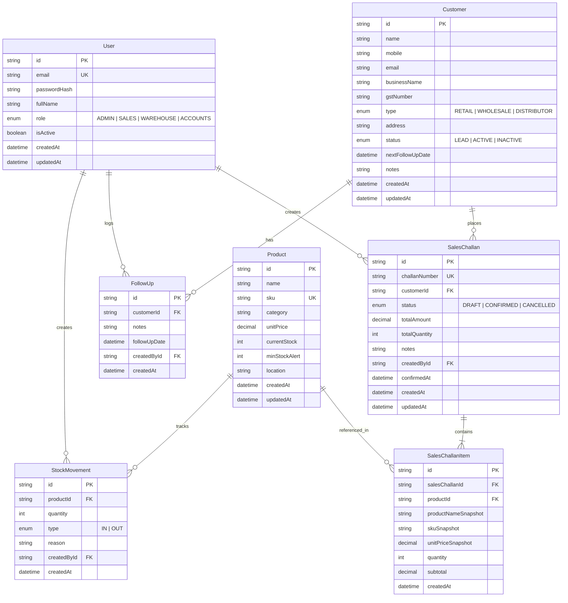

# Nexora ERP — Database Specification & Schema Design

## Product Title
**Nexora ERP — Operations & CRM Portal**

---

## 1. Entity-Relationship Diagram (ERD)



---

## 2. Enums Definition

### Role
- `ADMIN`: Full administrative operations and user management.
- `SALES`: Customer management, follow-ups, and draft/confirmation of sales challans.
- `WAREHOUSE`: Product management, manual IN stock entry, and movement logs.
- `ACCOUNTS`: Financial oversight, view-only access to customer ledgers and challans.

### CustomerType
- `RETAIL`: End retail consumer.
- `WHOLESALE`: Bulk wholesale buyer.
- `DISTRIBUTOR`: Regional distribution partner.

### CustomerStatus
- `LEAD`: Prospective client.
- `ACTIVE`: Transacting active customer.
- `INACTIVE`: Dormant or legacy customer.

### ChallanStatus
- `DRAFT`: Initial unpaid order draft; **does NOT alter inventory**. May be cancelled.
- `CONFIRMED`: Finalized sales order; **deducts inventory inside one atomic transaction**. Cannot be cancelled in initial case-study scope.
- `CANCELLED`: Voided order (DRAFT status only).

### MovementType
- `IN`: Add inventory (manual entry: purchase received, opening stock, stock correction).
- `OUT`: Remove inventory (systemic creation during challan confirmation only).

---

## 3. Comprehensive Table Schemas

### 3.1 `User` Table
| Column Name | Data Type | Constraints | Description |
| :--- | :--- | :--- | :--- |
| `id` | VARCHAR(36) | PRIMARY KEY | Unique UUID identifier |
| `email` | VARCHAR(255) | UNIQUE, NOT NULL | User login email address |
| `passwordHash` | VARCHAR(255) | NOT NULL | Bcrypt password hash |
| `fullName` | VARCHAR(255) | NOT NULL | Full display name |
| `role` | ENUM(`Role`) | NOT NULL, DEFAULT 'SALES' | System access role |
| `isActive` | BOOLEAN | NOT NULL, DEFAULT true | Account status flag |
| `createdAt` | TIMESTAMP | NOT NULL, DEFAULT NOW() | Record creation timestamp |
| `updatedAt` | TIMESTAMP | NOT NULL, DEFAULT NOW() | Record last update timestamp |

### 3.2 `Customer` Table
| Column Name | Data Type | Constraints | Description |
| :--- | :--- | :--- | :--- |
| `id` | VARCHAR(36) | PRIMARY KEY | Unique UUID identifier |
| `name` | VARCHAR(255) | NOT NULL | Contact person name |
| `mobile` | VARCHAR(20) | NOT NULL | Contact mobile number |
| `email` | VARCHAR(255) | NOT NULL | Contact email address |
| `businessName` | VARCHAR(255) | NOT NULL | Customer enterprise name |
| `gstNumber` | VARCHAR(20) | NULLABLE | Optional tax / GST number |
| `type` | ENUM(`CustomerType`)| NOT NULL, DEFAULT 'WHOLESALE' | Client classification |
| `address` | TEXT | NOT NULL | Delivery & billing address |
| `status` | ENUM(`CustomerStatus`)| NOT NULL, DEFAULT 'LEAD' | Lifecycle stage |
| `nextFollowUpDate`| TIMESTAMP | NULLABLE | Scheduled follow-up date |
| `notes` | TEXT | NULLABLE | Internal relationship notes |
| `createdAt` | TIMESTAMP | NOT NULL, DEFAULT NOW() | Record creation timestamp |
| `updatedAt` | TIMESTAMP | NOT NULL, DEFAULT NOW() | Record last update timestamp |

### 3.3 `FollowUp` Table
| Column Name | Data Type | Constraints | Description |
| :--- | :--- | :--- | :--- |
| `id` | VARCHAR(36) | PRIMARY KEY | Unique UUID identifier |
| `customerId` | VARCHAR(36) | FOREIGN KEY -> `Customer(id)` | Associated customer |
| `notes` | TEXT | NOT NULL | Logged interaction notes |
| `followUpDate` | TIMESTAMP | NOT NULL | Date of interaction |
| `createdById` | VARCHAR(36) | FOREIGN KEY -> `User(id)` | Staff member who logged entry |
| `createdAt` | TIMESTAMP | NOT NULL, DEFAULT NOW() | Record creation timestamp |

### 3.4 `Product` Table
| Column Name | Data Type | Constraints | Description |
| :--- | :--- | :--- | :--- |
| `id` | VARCHAR(36) | PRIMARY KEY | Unique UUID identifier |
| `name` | VARCHAR(255) | NOT NULL | Product title |
| `sku` | VARCHAR(100) | UNIQUE, NOT NULL | Stock Keeping Unit code |
| `category` | VARCHAR(100) | NOT NULL | Product grouping category |
| `unitPrice` | DECIMAL(12,2)| NOT NULL, CHECK (`unitPrice` >= 0) | Selling price per unit |
| `currentStock` | INT | NOT NULL, CHECK (`currentStock` >= 0) | Physical quantity on hand (Non-negative invariant) |
| `minStockAlert`| INT | NOT NULL, DEFAULT 10 | Low stock alert threshold |
| `location` | VARCHAR(100) | NOT NULL | Warehouse rack/bin location |
| `createdAt` | TIMESTAMP | NOT NULL, DEFAULT NOW() | Record creation timestamp |
| `updatedAt` | TIMESTAMP | NOT NULL, DEFAULT NOW() | Record last update timestamp |

### 3.5 `StockMovement` Table
| Column Name | Data Type | Constraints | Description |
| :--- | :--- | :--- | :--- |
| `id` | VARCHAR(36) | PRIMARY KEY | Unique UUID identifier |
| `productId` | VARCHAR(36) | FOREIGN KEY -> `Product(id)` | Affected product |
| `quantity` | INT | NOT NULL, CHECK (`quantity` > 0) | Quantity moved |
| `type` | ENUM(`MovementType`)| NOT NULL | Movement direction (IN / OUT) |
| `reason` | VARCHAR(255) | NOT NULL | Plain text audit description (NOT used for security/authorization logic) |
| `createdById` | VARCHAR(36) | FOREIGN KEY -> `User(id)` | Staff member executing move |
| `createdAt` | TIMESTAMP | NOT NULL, DEFAULT NOW() | Audit log timestamp |

### 3.6 `SalesChallan` Table
| Column Name | Data Type | Constraints | Description |
| :--- | :--- | :--- | :--- |
| `id` | VARCHAR(36) | PRIMARY KEY | Unique UUID identifier |
| `challanNumber` | VARCHAR(50) | UNIQUE, NOT NULL | Auto-generated document ID |
| `customerId` | VARCHAR(36) | FOREIGN KEY -> `Customer(id)` | Client ordering products |
| `status` | ENUM(`ChallanStatus`)| NOT NULL, DEFAULT 'DRAFT' | Workflow execution state |
| `totalAmount` | DECIMAL(12,2)| NOT NULL, DEFAULT 0.00 | Calculated monetary valuation |
| `totalQuantity` | INT | NOT NULL, DEFAULT 0 | Sum of item quantities |
| `notes` | TEXT | NULLABLE | Special delivery notes |
| `createdById` | VARCHAR(36) | FOREIGN KEY -> `User(id)` | Staff member who created draft |
| `confirmedAt` | TIMESTAMP | NULLABLE | Confirmation timestamp |
| `createdAt` | TIMESTAMP | NOT NULL, DEFAULT NOW() | Record creation timestamp |
| `updatedAt` | TIMESTAMP | NOT NULL, DEFAULT NOW() | Record last update timestamp |

### 3.7 `SalesChallanItem` Table
| Column Name | Data Type | Constraints | Description |
| :--- | :--- | :--- | :--- |
| `id` | VARCHAR(36) | PRIMARY KEY | Unique UUID identifier |
| `salesChallanId`| VARCHAR(36)| FOREIGN KEY -> `SalesChallan(id)` ON DELETE CASCADE | Parent challan |
| `productId` | VARCHAR(36) | FOREIGN KEY -> `Product(id)` | Source product reference |
| `productNameSnapshot`| VARCHAR(255)| NOT NULL | Immutable title snapshot |
| `skuSnapshot` | VARCHAR(100)| NOT NULL | Immutable SKU snapshot |
| `unitPriceSnapshot` | DECIMAL(12,2)| NOT NULL | Immutable unit price snapshot |
| `quantity` | INT | NOT NULL, CHECK (`quantity` > 0) | Ordered quantity |
| `subtotal` | DECIMAL(12,2)| NOT NULL | `unitPriceSnapshot * quantity` |
| `createdAt` | TIMESTAMP | NOT NULL, DEFAULT NOW() | Record creation timestamp |

---

## 4. Historical Data Snapshot Strategy

**Business Problem**: If a product's price or name changes in the catalog 6 months after a Sales Challan was generated, historical invoices/challans must NOT alter their original values.

**Solution**:
The `SalesChallanItem` table explicitly contains snapshot columns (`productNameSnapshot`, `skuSnapshot`, `unitPriceSnapshot`). When a Sales Challan is confirmed:
1. The backend preserves active `Product.name`, `Product.sku`, and `Product.unitPrice` into the snapshot fields.
2. Any subsequent edit to `Product.unitPrice` or `Product.name` alters only the `Product` catalog row.
3. Historical queries and reports calculate document totals exclusively from snapshot fields.

---

## 5. Single-Transaction Atomic Confirmation Flow

Challan confirmation relies on a single Prisma database transaction (`prisma.$transaction`) executing 7 atomic operations with a total rollback guarantee on any failure:

```typescript
// Single Transaction Execution for Challan Confirmation
await prisma.$transaction(async (tx) => {
  // 1. Validate Challan State (must be DRAFT)
  const challan = await tx.salesChallan.findUnique({
    where: { id: challanId },
    include: { items: true }
  });

  if (!challan || challan.status !== 'DRAFT') {
    throw new BadRequestError('Only DRAFT challans can be confirmed.');
  }

  // 2. Validate All Quantities & 3. Verify Stock Sufficiency
  for (const item of challan.items) {
    if (item.quantity <= 0) {
      throw new BadRequestError(`Invalid item quantity for product ${item.productId}`);
    }

    const product = await tx.product.findUnique({
      where: { id: item.productId }
    });

    if (!product || product.currentStock < item.quantity) {
      throw new InsufficientStockError({
        productId: item.productId,
        productName: item.productNameSnapshot,
        requested: item.quantity,
        available: product ? product.currentStock : 0
      });
    }
  }

  // 4. Reduce Product Stock, 5. Create Internal OUT Stock Movements, 6. Preserve Snapshots
  for (const item of challan.items) {
    const product = await tx.product.findUnique({ where: { id: item.productId } });
    
    // Reduce product stock (enforces currentStock >= 0 invariant)
    await tx.product.update({
      where: { id: item.productId },
      data: { currentStock: { decrement: item.quantity } }
    });

    // Create corresponding OUT stock movement internally
    await tx.stockMovement.create({
      data: {
        productId: item.productId,
        quantity: item.quantity,
        type: 'OUT',
        reason: `Sales Challan #${challan.challanNumber}`, // Plain text audit note (NOT used for security)
        createdById: userId
      }
    });

    // Preserve product snapshot
    await tx.salesChallanItem.update({
      where: { id: item.id },
      data: {
        productNameSnapshot: product.name,
        skuSnapshot: product.sku,
        unitPriceSnapshot: product.unitPrice
      }
    });
  }

  // 7. Mark Challan Status CONFIRMED
  return tx.salesChallan.update({
    where: { id: challanId },
    data: {
      status: 'CONFIRMED',
      confirmedAt: new Date()
    }
  });
  
  // Entire transaction commits here automatically. If any step throws an error, ALL operations roll back.
});
```
